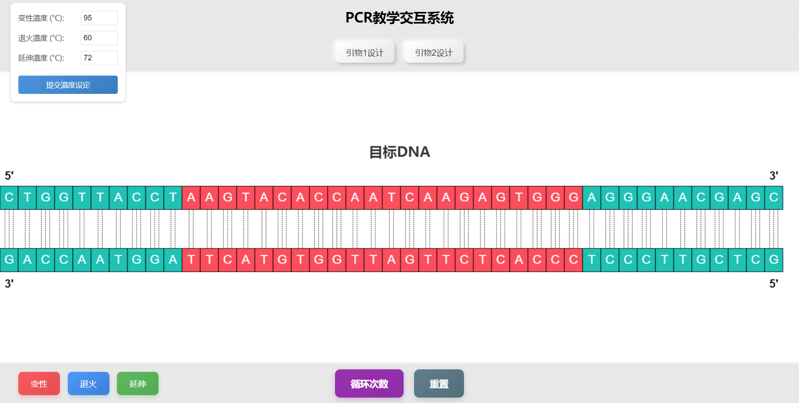

# PCR交互式教学系统

这是一个基于Web的PCR（聚合酶链式反应）交互式教学工具，帮助学生和教师直观理解PCR过程中的各个关键步骤。



## 功能特点

- **DNA双链直观展示**：使用动画方式展示DNA双链结构，中间22个碱基以红色标注，其余以绿色显示
- **PCR完整流程模拟**：包含变性、退火和延伸三个核心步骤
- **引物交互式设计**：支持用户自定义设计引物1和引物2的序列（A、T、C、G四种碱基）
- **温度参数调节**：可设置变性、退火和延伸三个阶段的不同温度
- **PCR过程可视化**：
  - 变性过程中DNA链分离的动画效果
  - 氢键断裂的平滑视觉表现
  - 退火阶段引物与模板DNA配对的过程
  - 延伸阶段DNA聚合酶工作和新链合成的可视化

## 使用说明

1. **温度设置**：
   - 变性温度：94-96°C
   - 退火温度：55-68°C
   - 延伸温度：72-78°C
   - 点击"提交温度设置"按钮确认参数

2. **引物设计**：
   - 点击"引物1设计"和"引物2设计"按钮
   - 输入4个碱基组成的序列（仅限A、T、C、G）
   - 提交设计的引物序列

3. **PCR操作流程**：
   - 点击"变性"按钮，观察DNA双链分离过程
   - 变性完成后，点击"退火"按钮，观察引物与模板DNA的配对
   - 最后点击"延伸"按钮，观察DNA链的延伸过程

4. **其他功能**：
   - 使用"循环次数"按钮了解PCR循环的相关信息
   - 使用"重置"按钮重新开始整个实验过程

## 技术实现

- **前端技术**：采用纯HTML5、CSS3和JavaScript实现
- **无外部依赖**：不需要任何第三方库或框架
- **动画效果**：使用Canvas API绘制DNA结构和PCR过程动画
- **自适应设计**：适配不同尺寸的屏幕和设备

## 教学价值

- 帮助学生直观理解PCR反应的分子机理
- 可视化展示DNA结构特点和引物作用机制
- 通过互动操作提高学习兴趣和参与度
- 展示温度参数对PCR过程的影响

## 本地部署方法

1. 克隆代码仓库：
   ```bash
   git clone https://github.com/yourusername/pcr-teaching-tool.git
   ```

2. 进入项目文件夹：
   ```bash
   cd pcr-teaching-tool
   ```

3. 使用浏览器直接打开`index.html`文件，或通过本地服务器运行：
   ```bash
   # 如果安装了Python
   python -m http.server
   
   # 或使用任何HTTP服务器
   ```

## 在线演示

访问[PCR交互式教学系统](https://yourusername.github.io/pcr-teaching-tool/)在线体验这个工具。

## 视觉元素说明

- **红色区域**：代表目标DNA区域（中间22个碱基）
- **绿色区域**：代表非目标DNA区域
- **淡黄色**：表示引物序列
- **黑色虚线**：表示碱基间的氢键连接
- **黑色边框**：为所有碱基添加的轮廓线

## 参与贡献

欢迎对本项目进行改进和扩展！请按照以下步骤：

1. Fork本代码仓库
2. 创建您的功能分支 (`git checkout -b feature/amazing-feature`)
3. 提交您的修改 (`git commit -m '添加某某功能'`)
4. 推送到您的分支 (`git push origin feature/amazing-feature`)
5. 创建Pull Request请求合并

## 开源许可

本项目采用 [MIT 许可证](LICENSE)。

## 联系方式

如有问题或建议，请[创建issue](https://github.com/yourusername/pcr-teaching-tool/issues)或直接联系项目维护者。

---

*本项目仅供教育目的使用，欢迎教师、学生和生物学爱好者使用与改进。* 